<!-- Premium GitHub Profile Hero -->
<picture>
  <source media="(prefers-color-scheme: dark)" srcset="./dark-v2.svg">
  <source media="(prefers-color-scheme: light)" srcset="./light-v2.svg">
  
</picture>

 

## Verified Learning

<table>
  <tr>
    <td width="50%" valign="top" align="center">
      
        
      <strong>Google AI Essentials</strong>
       
      Completed via Coursera
        
      Practical AI use, prompting, productivity workflows, and responsible AI usage.
        
      
    </td>
    <td width="50%" valign="top" align="center">
      
        
      <strong>AI Fluency for Students</strong>
       
      Completed via Anthropic / Skilljar
        
      Model collaboration, evaluation, discernment, and responsible AI use.
        
      
    </td>
  </tr>
</table>
