<!--
  Animated terminal-style profile inspired by Avi Vashishta's public guide and
  profile structure. All SVGs and generator scripts in this repository are
  customized for Vivaan and independently authored.
-->

<h3><code>vivaan@github ~ $ ./contributions.sh</code></h3>

 
 

<h3><code>vivaan@github ~ $ whoami</code></h3>

<table>
<tr>
<td valign="top"></td>
<td valign="top"></td>
</tr>
</table>

 
 

<h3><code>vivaan@github ~ $ ./projects.sh</code></h3>

<b>Local-first desktop software · AI products · privacy-conscious tools</b>

 
 

<h3><code>vivaan@github ~ $ ./credentials.sh</code></h3>

 
 

<h3><code>vivaan@github ~ $ ./contact.sh</code></h3>

 

Building with curiosity. Improving with evidence.

