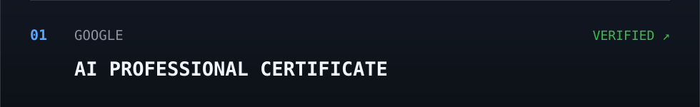
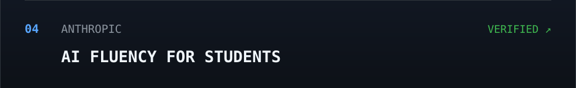

<!--
  Custom animated terminal-style GitHub profile.
  In the whoami section, each credential row is a separate linked SVG so the
  terminal-window design stays clean while each credential remains clickable.
-->

<h3><code>vivaan@github ~ $ whoami</code></h3>

<table>
<tr>
<td valign="top"></td>
<td valign="top">     </td>
</tr>
</table>

 
 

<h3><code>vivaan@github ~ $ ./contributions.sh</code></h3>

 
 

<h3><code>vivaan@github ~ $ ./contact.sh</code></h3>

 

Building with curiosity. Improving with evidence.

