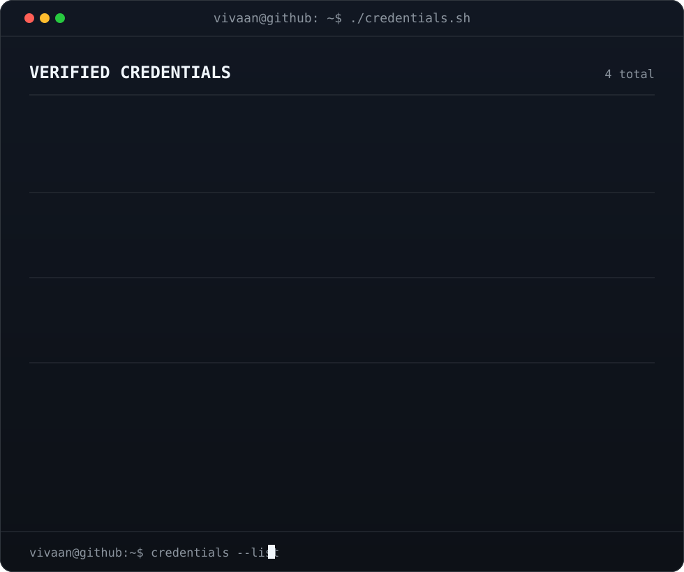

<!--
  Custom animated terminal-style GitHub profile.
  The whoami section uses an original animated VIVAAN wordmark on the left
  and a macOS-style credentials window on the right.
-->

<h3><code>vivaan@github ~ $ whoami</code></h3>

<table>
<tr>
<td valign="top"></td>
<td valign="top"></td>
</tr>
</table>

 
 

<h3><code>vivaan@github ~ $ ./contributions.sh</code></h3>

 
 

<h3><code>vivaan@github ~ $ ./contact.sh</code></h3>

 

Building with curiosity. Improving with evidence.

